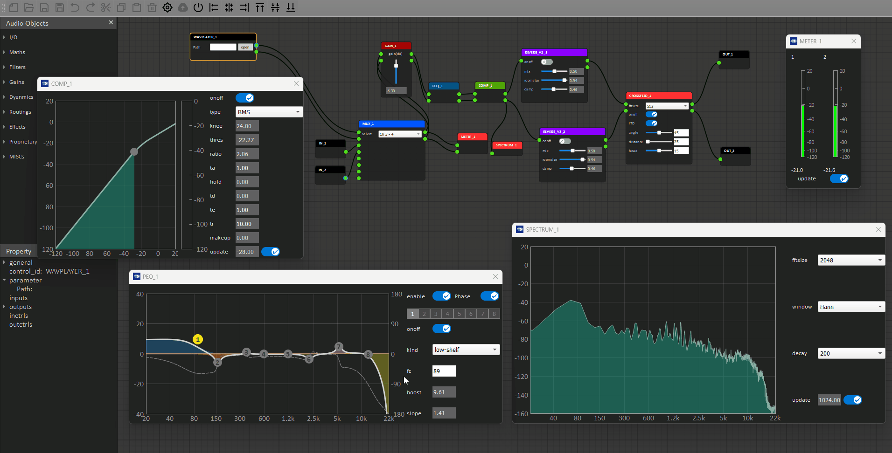
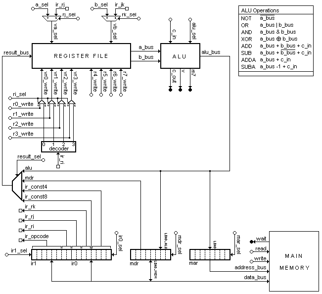
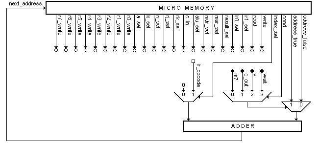
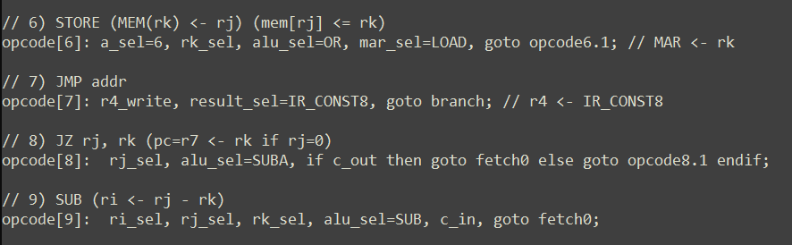
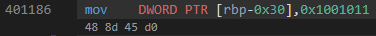
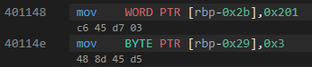
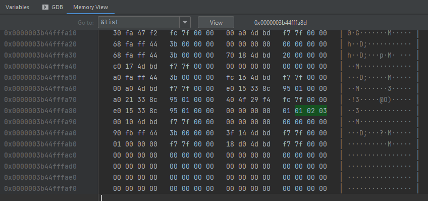
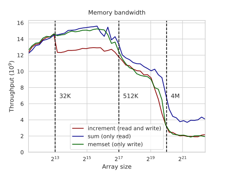
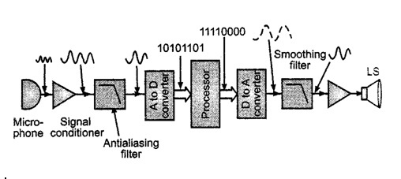
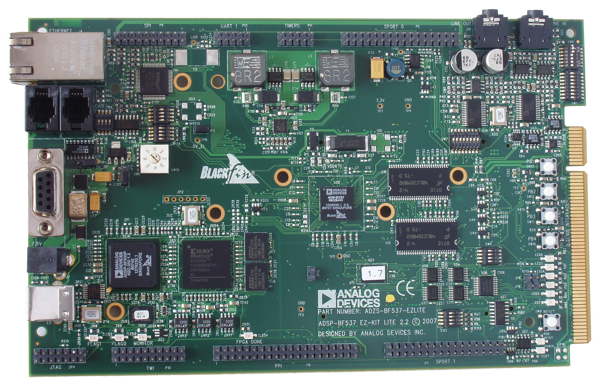

# Heterogeneous computing - CPU and DSP performance



> Audio processing is a good example of a domain where constant cycle-count operations are required to achieve valid results. Image source: [Peerless Audio's Flow DSP](https://peerless-audio.com/flow-dsp/)

It is clear that for many domains, we cannot afford to leave silicon performance on the table

This series of project experiments with the main parts of modern heterogeneous computer systems. The main goal was to examine the relevant abstractions, performant use cases and limitations, along with limitations and best practices.

Popular specifications, runtimes and libraries were examined too, as these greatly broaden modeling capabilities of modern software.

Using (general-purpose) CPU to its fullest has a great impact on performance, but for the most demanding of use cases, specialized hardware is required. Some commonly seen examples these days are:

- GPUs - highly parallelized processors, used for matrix operations, often in 3D graphics and machine learning

- Floating-point Processing Units (FPUs) - circuits specialized to execute floating point math

- Digital Signal Processors (DSPs) - specialized instructions and large accumulator registers for numeric algorithms (fold/reduce/accumulate, transform/map)

- Embedded Processors - usually packaged with various sensing, actuating and communication peripherals, all the while minimizing energy consumption, and often providing real-time guarantees

## Contents

1. CPU and Cache
   
      1. micro-instructions
   
      2. machine code
   
      3. memory endianness
   
      4. caches
   
      5. Best practices

2. DSP Co-Processing

Analysis of GPUs and FPGAs can be found in the neighboring `HPC - GPU` and `GPC - FPGA` repos.

---

# CPU and Cache

## Microprogramming

For a better understanding of why certain machine instructions have a longer time constant then others, beyond just the sheer amount of silicon dedicated to certain types of operations, microprogramming was examined - a process of creating "complicated" CPU instructions ("microcode") by combining several elementary "micro-operations", and storing such sequences ("CPU firmware") into CPU's control memory<sup>1</sup>.

> 1 - some CPUs have a hardware-implemented control unit, instead a programmable one, so this does not apply.

The elementary instructions in question could be:

- move data from a register to the bus, and vice-versa

- move data from the bus to main memory, and vice-versa

- select a specific arithmetic or logical operation on the ALU

- read CPU flags (zero, overflow, carry, negative...)

For practical reasons, instead of a real CPU, the [MythSim](https://github.com/jasonv/MythSim) simulator for the University of Illinois was used to test and debug the microcode. To run it, you need to have `JVM 1.4` or higher on your machine, then you simply open the `mythsim-<version>.jar`, which opens a GUI, allowing you to load your microcode and test programs.

MythSim offers the following CPU model:



- 8x 8-bit registers, seen near the top
  
     - no dedicated PC, SR and SP registers, so the 8 generic ones are used for those purposes as well

- 16-bit instruction register and 8-bit memory address and data registers (MDR and MAR), seen at the bottom

- ALU with 8 operations

- a_bus and b_bus for the operands, and result_bus for the result

Its three-address machine/macro instruction takes the following form:

| 15........10 | 9..........8 | 7..........6 | 5..........4 | 3..........0 |
| ------------ | ------------ | ------------ | ------------ | ------------ |
| ir_opcode    | ir_ri        | ir_rj        | ir_rk        | ir_const4    |

The control unit looks like so:



It offers conditional microcode branching (depends on CPU flags, or memory busy flag), and beyond that it translates the microcode into appropriate selections of registers, buses and operations.

The following instructions were implemented (`mprog.ucode`) and tested (`mprog.mem`):

- LOAD&STORE (memory<->reg), MOVE(reg<->reg)

- NOP, HALT

- JUMP (set PC/r7 to const), JZ (jump if zero flag in SR/r6)

- ADD, SUB, SHL (shift left)

- LDSP (set SP/r5), PUSH&POP (register<->stack)

- CALL, RET



<sup>[⌃ Go back to top ⌃](#contents)</sup>

---

## Machine code

Even for embedded programming, machine code is the lowest abstraction level which might on occasion be examined, to ensure the programmer and compiler understood each other:

- constexpr expression really got executed at compile time

- for-loops successfully vectorized

- unnecessary memory copies avoided through (N)RVO

- small functions inlined etc.

With the added understanding of what is an ABI, it becomes easier to

- bridge software written in different languages

- work with the debugger, and analyze crash dumps

- understand the "why" behind higher-level best practices (value-semantics, compile-time checks, hoisting variables out of loops)

- better utilize available hardware

[x86 calling conventions](https://en.wikipedia.org/wiki/X86_calling_conventions) were studied, and a handful of functions were implemented in machine code directly, as well as C, then liked to together to confirm compatibility, and verified using GDB CLI

```bash
> g++ -O0 -S -masm=intel lab1gcc.cpp   # get C++ machine code, and do not continue packaging into an exe
```

```c
loopsum_asm_86:
                     /* cdecl prologue: */
  push  ebp          /* ret addres now at [ebp+4] */
  mov   ebp, esp     /* current frame base pointer now points to (our) top of the stack */
  push edi           /* save status */

  mov edi, [ebp+20]  /* *R */
  mov edx, [ebp+16]  /* count */
  mov ecx, 0         /* i */
  mov ebx, [ebp+12]     /* B */
  mov eax, [ebp+8]     /* A */

  cmp edx, 0
  jz ret_86
  fldz
  beg_86:  cmp ecx, edx 
    jge store_86

    fld DWORD PTR [eax+ecx*4]    /* load A[i] on float stack */
    faddp                        /* stack=stack+A[i] */
    fld DWORD PTR [ebx+ecx*4]    /* load B[i] on float stack  */
    faddp                        /* stack=stack+B[i] */

    add ecx, 1
    jmp beg_86

  store_86: fstp DWORD PTR [edi]


ret_86:  pop edi
                     /* cdecl epilog: */
  pop ebp            /* restore caller ebp, == 'leave' */
  ret                /* ret address to PC */  
```

Then to compile into a executable and run in a debugger:

```bash
> g++ -g -o lab1gcc potprogram_asm.s lab1gcc.cpp   # compile and link the .cpp and .s files together
> .\out.exe
ASM: 6
C++: 6

> gdb out

#    break - Suspend program at specified function of line number
break 4     # suspend at line 4
b main      # suspend when entering main

run         # when suspended, use this to continue
next        # execute next line of code (will not enter functions), then suspend again
step        # step into the next line of code (will enter functions), then suspend again

print x     # print value of variable x
bt          # prints the stack frame
info registers        # prints values in registers
info all-registers    # prints standard and additional registers

q           # exit gdb
```

Do note that if we do need to manually include machine code snippets, it is probably easier to do so inline, as can be seen in `math.h` for example:

```cpp
#elif defined(__i386__) || defined(_X86_)
    unsigned short sw;
    __asm__ __volatile__ ("fxam; fstsw %%ax;" : "=a" (sw): "t" (x));
    return sw & (FP_NAN | FP_NORMAL | FP_ZERO );
#endif
```

<sup>[⌃ Go back to top ⌃](#contents)</sup>

---

## Endianness

If we have to serialize a [standard-layout](https://en.cppreference.com/cpp/language/type) object and send it over the network, the receiver might have to pass it to [std::byteswap](https://en.cppreference.com/cpp/numeric/byteswap) before trying to deserialize it, if the two systems do not share endianness. This is why:

```c
#include <assert.h>

int main() {
    char list[3] = {1, 2, 3};

    char *p = &list[0]+sizeof(list)-1; // char pointers have special aliasing permissions, allowing byte inspection

    // Elements inside a list are in Big endian order ("smaller" elements at lower addresses)
    assert (*p == list[2]);


    int num = 16781329; // == 0x 01 00 10 11

    char *p1 = (char*) &num;
    char *p2 = p1+1;
    char *p3 = p1+2;
    char *p4 = p1+3;

    // Bytes inside a word are in Little endian order (smaller bytes have higher addresses)
    assert (*p1 == 0x11 && *p2 == 0x10 && *p3 == 0x00 && *p4 == 0x01);

    return 0;
}
```

<sup>[run this example](https://godbolt.org/z/5EPzodbsE)</sup>

In other words, on most modern systems, the order of bytes in a word is opposite to the usual memory indexing order we are used to:







<sup>[⌃ Go back to top ⌃](#contents)</sup>

---

## Cache



To help understand while speeds drop and latencies rise as more data is processed, and get a better intuition for the impact of cache on program performance, we can write a short benchmark (`cacheCliffs.cpp`) which

- sweeps through various amounts of integers

- for each amount N, it allocates a vector of N integers and fills it with values <0, N-1>, then shuffles the vector

- then it times how long it takes to do
  
     - 100 accumulations of the vector, then divides the data size with average duration of each accumulation
  
     - 1'000'000 dereferences (each dereferenced value represents the next index to be dereferenced), then calculates average dereference delay per element

For reference, on both Windows (LLP64) and Linux (LP64), integers are 32-bit. So, 512KB stores $512*1024*8 / 32 == 131072$ integers

```cpp
std::array<int, 131'072> ints{};
std::println("sizeof(int)={} (B)", sizeof(int));              // sizeof(int)=4 (B)                          
std::println("sizeof(ints)={} (KB)", sizeof(ints)/1024);      // sizeof(ints)=512 (KB)
```

Here are the results obtained on the authors machine:

```
 Data Size    | Num of ints | Sum (GB/s)  | Latency (ns/element)  
----------------------------------------------------  
        16 KB |       4'096 |       29.20 |         1.00  // L1
        32 KB |       8'192 |       28.52 |         1.02  // L1
        64 KB |      16'384 |       28.58 |         2.25  // L2
       512 KB |     131'072 |       28.52 |         3.91  // L2
      2048 KB |     524'288 |       16.30 |         9.27  // L3
     16384 KB |   4'194'304 |       14.07 |        29.13  // L3
     32768 KB |   8'388'608 |       13.92 |        82.04  // RAM
```

To validate our findings, we can cross-reference them with actual cache sizes. `GetLogicalProcessorInformation()` from `sysinfoapi.h` (on Windows; for Linux try `getconf -a | grep CACHE` or [other ways](https://cppbenchmarks.wordpress.com/2020/09/12/how-to-get-the-cpu-cache-size-on-linux/)) can give us exactly that information:

```
Lvl   |   Total Size |  Line Size |   Line Count
----------------------------------------------------------
L1    |        32 KB |       64 B  |          512
L2    |       512 KB |       64 B  |         8192
L3    |     16384 KB |       64 B  |       262144
```

Notes

- The integer array is not the only thing loaded in memory, which is why we see worsening performance even before we exceed the size of a particular cache level. 

- layers are hierarchical, so performance will worsen gradually, as the percentage of cache misses rises

- in the sequential accumulation test, the prefetcher is mitigating the some would-be cache misses, which slightly skews the cache analysis

These "complications" highlight how modern systems use [many mechanisms](https://en.wikipedia.org/wiki/Instruction-level_parallelism) to improve performance (e.g. branch prediction, out-of-order execution, superscalar execution), on top of compiler optimizations, making concrete benchmarks more valuable then pure theory

<sup>[⌃ Go back to top ⌃](#contents)</sup>

---

## Best practices

Applying some of the findings theorized above, a handful of benchmarks were carried out in `goodHwPractices.cpp`:

- Array of Structs vs Struct of Arrays: how long does it take to process 1M 128-byte particles, modeled as structs (AoS), or with their members stored separate arrays (SoA)

- Random vs Sequential: prefix-summing 64MB of data sequentially and randomly

- Sequential vs Tiled: Two sequential passes of 32MB of data vs doing both operations in 512KB chunks

- False sharing vs Cache-line alignment: two atomic integers incremented 10M times, either on the same cache line, or aligned to `std::hardware_destructive_interference_size`

- Random vs Sorted: Sequential access of 10M elements with conditional additions, over unsorted and sorted arrays

- Dependent calculations vs ILP: 100M iterations where each of three operations need the result of the previous, vs independent operations

| Area                           | -O0 'bad' [ms] | -O0 'good' [ms] | -O3 'bad' [ms] | -O3 'good' [ms] | O0 'bad'/'good' | O0/O3 'good' |
| ------------------------------ | -------------- | --------------- | -------------- | --------------- | --------------- | ------------ |
| AoS vs SoA                     | 7'044          | 20'101          | 7'148          | 1'381           | <u>x0,35</u>    | x14,56       |
| Random vs Sequential           | 803'450        | 89'035          | 121'900        | 9'463           | x9,02           | x9,41        |
| Sequential vs Tiled            | 26'488         | 61'601          | 5'565          | 3'601           | x4,01           | x1,83        |
| False sharing vs cache-aligned | 151'025        | 56'014          | 133'464        | 43'630          | x2,70           | x1,28        |
| Random vs predictable branches | 53'644         | 21'285          | 3'057          | 3'081           | x2,52           | x6,91        |
| Dependent vs ILP               | 843318         | 299950          | 231130         | 93025           | x2,81           | x3,22        |

Notes

- As differences between `-O0` and `-O3` show, the compiler and its optimizations play a big role in the results.
  
     - For example, it looks like the compiler was able to apply the same optimizations for the AoS example with both `-O0` and `-O3`, resulting in pretty much the same results for both
  
     - However, in `-O0`, it was not able to optimize the usually-better SoA approach as well as AoS!
  
     - Or for the branch prediction example, the compiler was able to apply same optimizations to both cases, resulting in `-O3` results being the same for the "bad" and "good" implementation

---

# DSP Co-Processing



One example of a demanding, usually time-critical use case where we want to carry out as many calculations as possible, is signal processing in telecommunications. To make telecommunication equipment more flexible, we prefer to make it [software-defined](https://en.wikipedia.org/wiki/Software-defined_radio) instead of fixed in hardware. An example of such a high-throughput software component is a FIR filter.

$$
y[n]=∑_{k=0}^{N-1} ​h[k]*x[n−k]
$$

To see how even a simple DSP might outperform modern, general-purpose CPUs when it comes to executing a low-pass FIR filter, a simple benchmark was done using a Analog Devices' BF537 DSP (Blackfin architecture):

- single-core, with both 32 general purpose and 16-bit DSP instructions

- Dedicated (hardware) multiply-and-accumulate circuits

- SIMD support, orthogonal instruction set, shared register bank, L1&2 cache, DMA, MMU (can run an OS, like uCLinux)



The benchmark details can be found in `./dsp/fir.pdf`, which contains:

- filter design process, coefficient calculation, as well as calculation of expected values in MatLab

- all implementations, their output values to verify correctness, and number of executed instructions

This is the summary of the results

| Test                   | Description                                                                                        | Median cyc/tap | Cyc total (10 taps) | Max samples/s (fCpu=300MHz/median cyc/tap) | At 5GHz   |
| ---------------------- | -------------------------------------------------------------------------------------------------- | --------------:| -------------------:| ------------------------------------------:| ---------:|
| Float+mod idx          | A naive implementation, representing data with float, using modulo operations for index wraparound | 2574           | 22962               | 116'550                                    | 1'942'502 |
| Float+circindex        | Swapped modulo for built-in circindex() method                                                     | 2262           | 19668               | 132'600                                    | -         |
| Int                    | Representing data as int instead of float                                                          | 357            | 3570                | 840'336                                    | -         |
| Short                  | Representing data as short instead of int                                                          | 400            | 3990                | 750'000                                    | -         |
| fract16                | Representing data as built-in fract16 instead of short                                             | 155            | 1545                | 1'935'483                                  | -         |
| fract16+DSP fir_fr16() | Using built-in fir_fr16() method instead of normal add() and multiply()                            |                | 278                 | 10'791'366                                 | -         |

- The Float+modulo index is the only example which can run on both a general-purpose and DSP CPU, since all following optimizations require built-in DSP methods, meaning the resulting cycle count improvements can only be achieved on a DSP processor

- ADSP-BF592 is a single-core, 300MHz CPU from 2006, so it is not surprising that switching from floating-point to integer operations improves performance by an order of magnitude

- However, even a modern 5GHz core cannot compete with the hardware-implemented fir_fr16() function, which adds an another order of magnitude performance improvement, turning the original 22962 machine instructions into 278.

- We can also note that integer, and especially the built-in types, have a much smaller STDDEV of cycles per tap, meaning they are not only faster, but also predictable, which is important for many industry applications.

<sup>[⌃ Go back to top ⌃](#contents)</sup>

---
